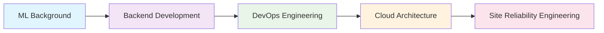

# Hi there, I'm Dheo Putranta Pandia

  

---

## About Me

**Information Systems Student** at Prima University of Indonesia  
**Current Role:** Junior DevOps Engineer at Universitas Prima Indonesia  
**Background:** 12+ months experience in Machine Learning and Data Science  
**Cloud Experience:** Hands-on experience with GCP, AWS, and currently operating on Linode  
**Focus:** Building production-ready infrastructure for scalable applications  

---

## Technical Skills

### Cloud Platforms & Infrastructure

### DevOps & Automation

### Monitoring & Observability

### Previous Experience (ML/Data Science)

---

## GitHub Analytics

  

---

## Current Projects & Focus

### Prima Mart Backend - Production Infrastructure
**Role:** Backend Developer & DevOps Engineer  
**Tech Stack:** Node.js, TypeScript, PostgreSQL, Docker, PM2, Nginx, GitHub Actions  
**Cloud Platform:** Currently deployed on Linode

**Infrastructure Highlights:**
- Multi-stage Docker containerization with Alpine Linux
- CI/CD pipeline with automated testing and deployment
- PM2 cluster mode with auto-scaling and health monitoring
- Nginx reverse proxy with load balancing configuration
- Zero-downtime deployment with rollback capabilities
- Comprehensive health checks and monitoring integration

### Cloud Infrastructure Experience
- **Linode (Current):** Production deployment and VM management
- **AWS:** EC2, S3, RDS, and basic networking setup
- **Google Cloud Platform:** Compute Engine and storage services

---

## Learning Roadmap

### Currently Learning
- **Service Mesh Architecture** (Istio, Linkerd)
- **GitOps Workflows** (ArgoCD, Flux)
- **Advanced Kubernetes** (Custom Resources, Operators)
- **Infrastructure Security** (Vault, Policy as Code)
- **Observability Stack** (Jaeger, OpenTelemetry)

### Next Quarter Goals
- [ ] Implement Kubernetes cluster on Linode
- [ ] Set up GitOps pipeline with ArgoCD
- [ ] Configure comprehensive monitoring stack
- [ ] Explore multi-cloud deployment strategies
- [ ] Obtain cloud certifications (AWS/GCP)

---

## Featured Work

**Architecture Overview:**
- **Application Layer:** Express.js API with TypeScript
- **Database:** PostgreSQL with connection pooling
- **Process Management:** PM2 with cluster mode
- **Reverse Proxy:** Nginx with upstream configuration
- **Containerization:** Docker with multi-stage builds
- **CI/CD:** GitHub Actions with automated deployment
- **Monitoring:** Health endpoints and log aggregation

---

## Professional Development

### Experience Timeline
**2024 - Present:** DevOps Engineer & Backend Developer  
**2023 - 2024:** Machine Learning Engineer (6+ months)  
**2023:** Information Systems Student, Prima University Indonesia

### Technical Achievements
- Designed and implemented production-ready backend infrastructure
- Configured CI/CD pipelines reducing deployment time by 80%
- Managed cloud VMs across AWS, GCP, and Linode platforms
- Built monitoring solutions with 99.9% uptime tracking
- Automated deployment processes with zero-downtime releases

---

## Connect

---

**Building reliable infrastructure for scalable applications**

---

  

